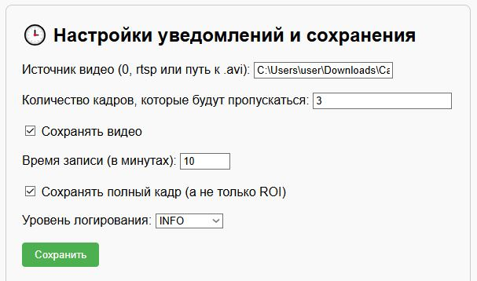

## 🚨 Car_Detector

Проект видеомониторинга с использованием детектора объектов YOLOv8. Распознаёт автомобили и государственные регистрационные знаки в режиме реального времени, сохраняет в видеофайл, также сохраняет логи и изображения детектированных объектов.

### 🔧 Возможности

- 🎥 Распознавание видеопотока с камеры (Web, IP) и видеофайлов (".avi", ".mp4", ".mkv")
- 📦 Обнаружение авто
- 🔢 Распознавание автомобильных номеров
- 🧠 Настраиваемый веб-интерфейс на FastAPI
- 📁 Сохранение обработанных видеофайлов, логов и изображений
- 🎨 Цветовая палитра по классам
- 🔄 Автоматический перезапуск при ошибках

### 📸 Примеры работы


## ⚙️ Установка

```bash
git clone https://github.com/i-koskin/Car_Detector.git
cd Car_Detector
python -m venv venv
venv\Scripts\activate  # Windows
pip install -r requirements.txt
```

### 📁 Структура

- `recordings/` — сохранённые видеофайлы
- `logs/images/` — сохранённые кадры
- `logs/YYYY-MM-DD_log.log` — журнал работы системы
- `docs/` — скриншоты работы системы

### 🛠️ Интерфейс конфигурации

```bash
uvicorn web_interface:app --reload --port 8000
```



### 🚀 Запуск

```bash
python main.py
```

