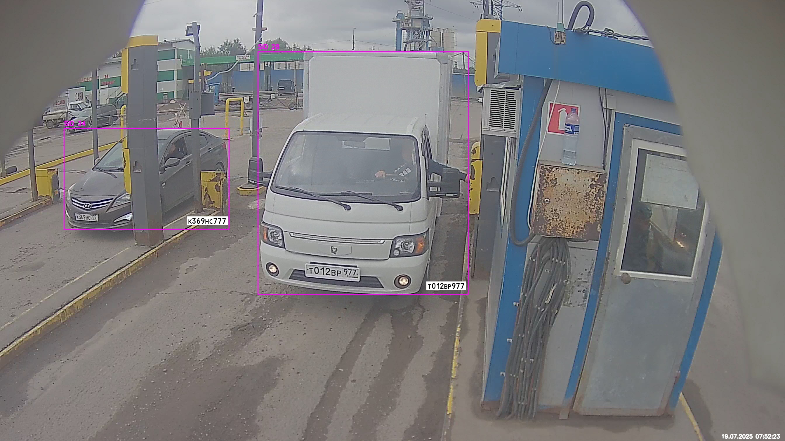
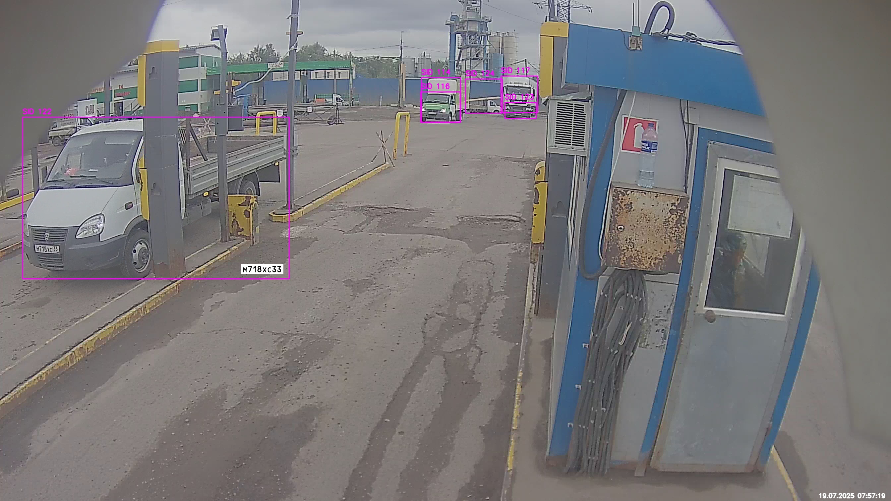
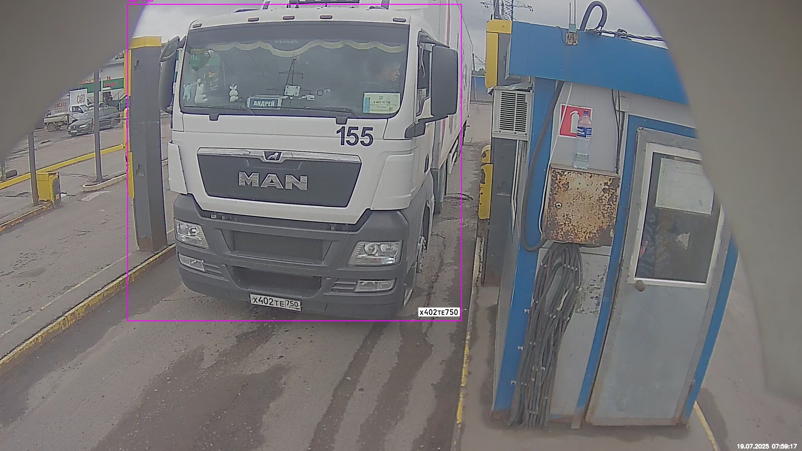
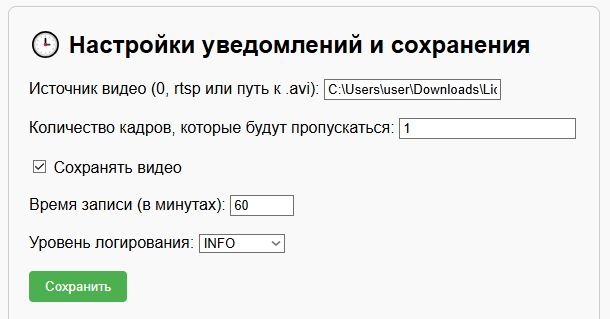

# 🚔 License_Plate_Recognition_System_RUS

## Система автоматического распознавания государственных регистрационных знаков автомобилей

<p align="center">

</p>

## 🔍 Возможности

- 🚗 Детекция транспортных средств (автомобили, автобусы, грузовики) с использованием моделей YOLO и трекингом автомобилей между кадрами с помощью ByteTrack из библиотеки Supervision
- 🔠 Распознавание номерных знаков с поддержкой кириллицы с использованием PaddleOCR
- ⏱ Обработка видео в реальном времени
- 🛠 Работа с несколькими автомобилями в кадре
- 🖼️ Отображение результатов в реальном времени
- ✂️ Настройка продолжительности записи обработанного видео для последующего сохранения
- 💾 Сохранение изображений даже при неудачной попытке распознавания
- 📝 Сохранение распознанных номеров в Excel
- 🖥 Поддержка GPU (CUDA) для ускорения обработки
- 📹 Работа с различными источниками видео (веб-камера, IP-камера, видеофайлы)

## 📸 Примеры работы

<p align="center">



  
</p>

## ⚙️ Установка

```bash
git clone https://github.com/i-koskin/License_Plate_Recognition_System_RUS.git
cd License_Plate_Recognition_System_RUS
python -m venv venv
venv\Scripts\activate  # Windows
pip install -r requirements.txt
```
⚠️Скачайте по ссылке 👇 и разместите в папке 👉 **yolo_weights/** модель для распознавания номерных знаков автомобилей:
```bash
https://drive.google.com/file/d/1HBKeEvNWWI7z0ENeYYQwI9BqdmfFj2HS
```
* Модель yolov8_plate.pt дополнительно обучена для распознавание номерных знаков автомобилей на 3000+ изображениях.


## 📁 Структура проекта

.

├── yolo_weights/                   # Веса моделей

├── fonts/                          # Шрифты для отображения текста

├── results/                        # Результаты работы

│   ├── images/                     # Изображения транспортных средств

│   ├── 2025-07-19_07-50_cvtest.avi # обработанный видеофайл

│   └── recognized_plates.xlsx      # Лог распознанных номеров

├── logger.py                       # Модуль логирования

├── video_writer.py                 # Модуль записи видео

└── ...                             # Другие модули

├── config.json                     # Основной конфигурационный файл

├── main.py                         # Главный скрипт

└── requirements.txt                # Зависимости

## 🛠️ Интерфейс конфигурации

```bash
uvicorn web_interface:app --reload --port 8000
```
<p align="center">

</p>

## 🚀 Запуск

```bash
python main.py
```

## 🛑 Остановка

Остановка по клавишам "q" или "Esc"
